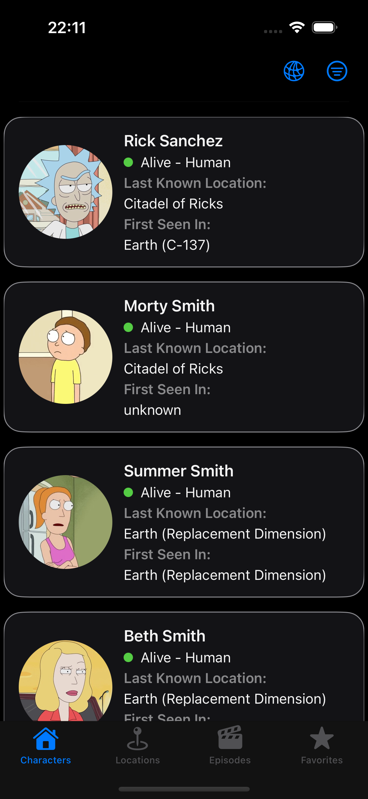
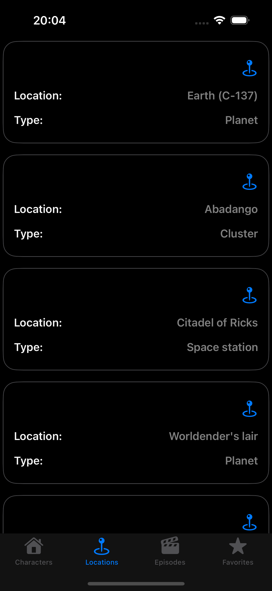
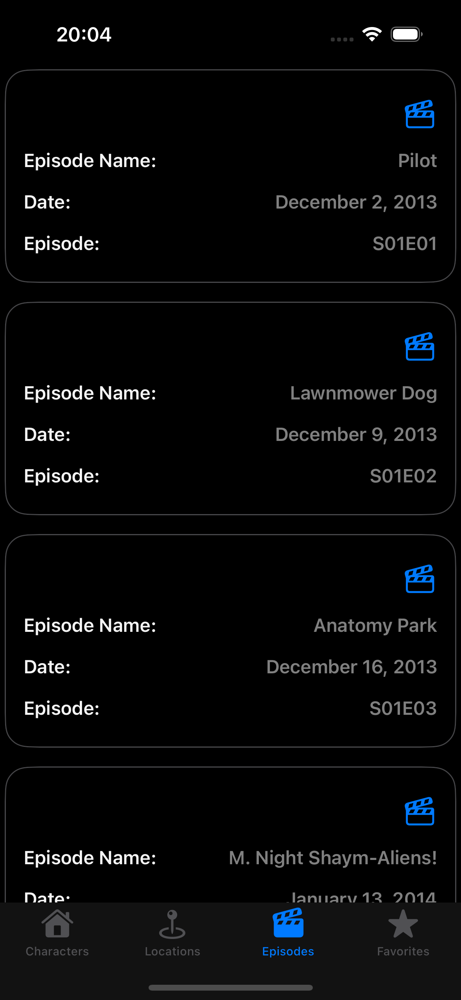
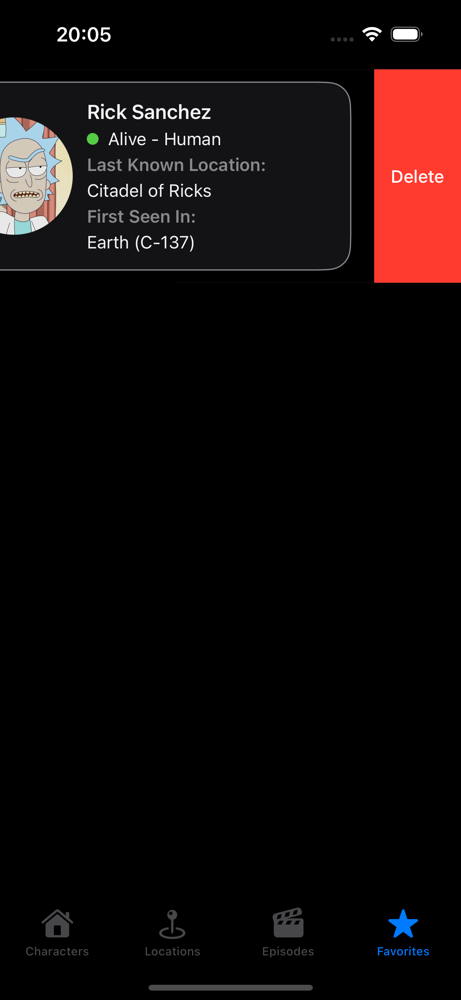
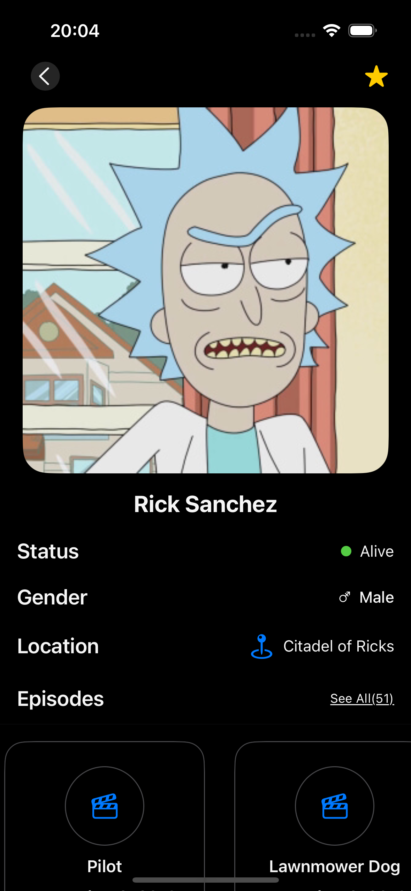
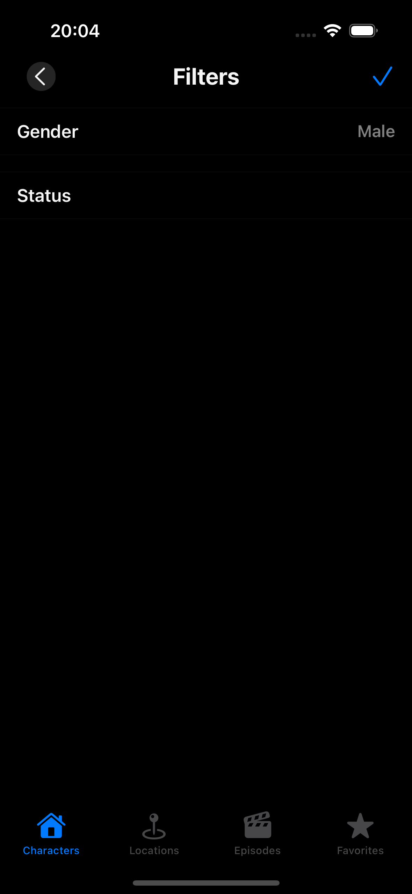

# RickandMorty Swift UI App

## Technologies & Libraries

+ Swift UI
+ Swift Data
+ MVVM
+ SDWebImage

## API
https://rickandmortyapi.com/

## Screenshots
|                                                       |                                                                                   |                                                                                         |
|:-----------------------------------------------------:|:---------------------------------------------------------------------------------:|:---------------------------------------------------------------------------------------:|
|  |  |  |

|                                                       |                                                                                   |                                                                                         |
|:-----------------------------------------------------:|:---------------------------------------------------------------------------------:|:---------------------------------------------------------------------------------------:|
|  |  |  |

