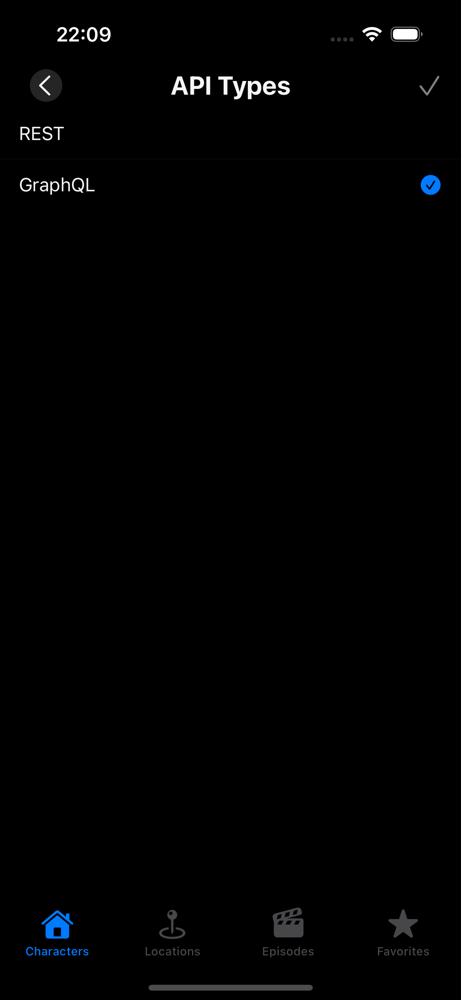

# RickandMorty Swift UI App

## Description

Yet another boring CRUD app — but this time built to explore and learn SwiftUI. It fetches data from the Rick and Morty API using both REST and GraphQL, just to keep things a bit more interesting. 

## Technologies & Libraries

+ Swift UI
+ Swift Data
+ MVVM
+ SDWebImage
+ Apollo iOS
+ GraphQL

## API

This app uses both **REST** and **GraphQL** endpoints provided by the [Rick and Morty API](https://rickandmortyapi.com/):

- REST: [https://rickandmortyapi.com/api](https://rickandmortyapi.com/api)
- GraphQL: [https://rickandmortyapi.com/graphql](https://rickandmortyapi.com/graphql)

## Screenshots
|                                                       |                                                                                   |                                                                                         |
|:-----------------------------------------------------:|:---------------------------------------------------------------------------------:|:---------------------------------------------------------------------------------------:|
|  |  |  |

|                                                       |                                                                                   |                                                                                         |
|:-----------------------------------------------------:|:---------------------------------------------------------------------------------:|:---------------------------------------------------------------------------------------:|
|  |  |  |

|                                             |
| :-----------------------------------------: |
| |  
